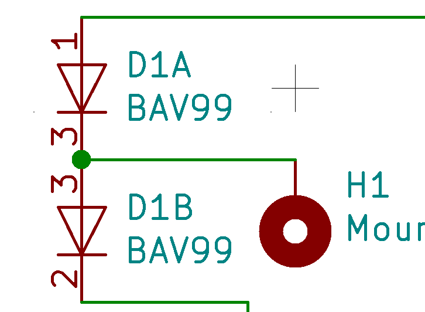
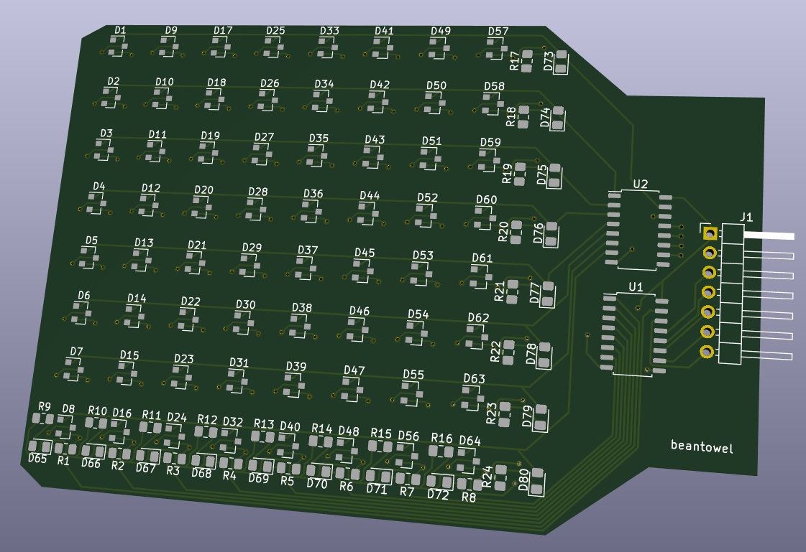
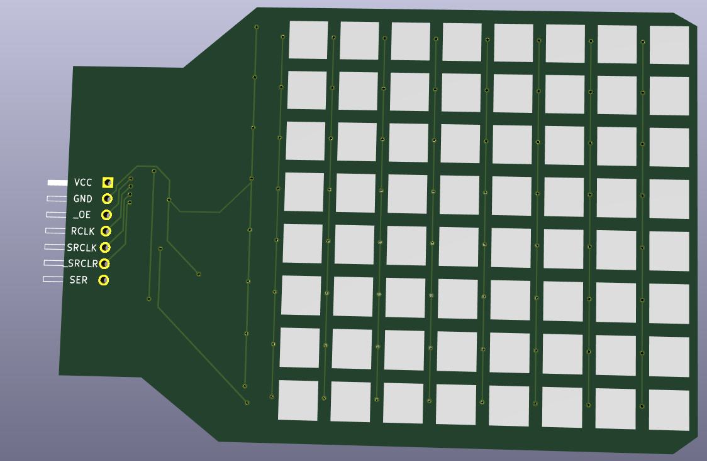

# An attempt to make a Capacitive Touch Screen Stimulator

This project attempts to build a device which simulates human finger touch on a capacitive touch screen. We used two high-speed double diodes to build a switch which controls the connection between the conductive surface and the ground. If "the resistance be extremely high and the parasitic capacitance extremely low in the OFF state", then the induced equivalent capacitance would be very small, thus the touch screen won't detect it.

We built an array of these switches in a PCB, so we can use an MCU to control the stimulation in a 2-D plane.

By using PWM, we tried to reach higher resolution with limited conductive pads, since the area of these pads needs to be large to gain enough capacitance.

